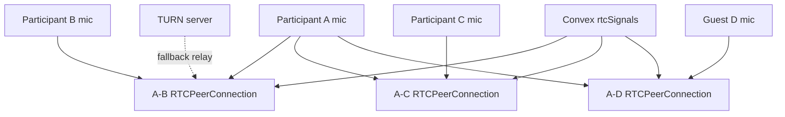

# Peer-to-Peer Mesh Audio Room

## Context

`bbpc-recording` should replace Google Meet for the live podcast call. V1 supports 3 regular hosts plus 1 occasional guest in an audio-only WebRTC mesh, while preserving the existing local-track recording and merge workflow.

Target browsers are Chrome on Windows 10 and Chrome on iOS. Chrome on iOS must be treated as an iOS WebKit runtime for testing, so autoplay, capture permission, and device-selection behavior must be verified on a real iPhone.

TURN is assumed to exist before this work starts. TURN provisioning belongs in a separate operational task.

## Current State

| Area | Current behavior | Gap |
| --- | --- | --- |
| Mic recording | `src/hooks/useRecordingEngine.ts` records local mic blobs. | No live mic transmission to other participants. |
| Recording sync | `src/hooks/useRecordingSync.ts` syncs recording start/stop events. | No audio-room join/leave/connectivity state. |
| Session sync | `src/hooks/useSessionSync.ts` appends durable session events. | WebRTC signaling is too chatty and ephemeral for this table. |
| Identity | `src/lib/sessions/store.ts` creates `clientId` and `accessToken`; `src/app/sessions/[sessionId]/page.tsx` verifies grants before rendering. | The client does not receive the access token needed to authenticate RTC signaling mutations. |
| Manifest | `recording_participants` logs recording join/leave intervals. | No audio-room intervals or network-loss intervals. |
| Merge | `scripts/merge-session-bundle.mjs` mixes uploaded mic/sounder tracks by `startedAt`. | Needs to tolerate participant disconnect intervals without requiring remote mix tracks. |

## Proposed Change

Add an audio-only WebRTC mesh room. Each participant who clicks `Join Audio` opens one `RTCPeerConnection` to every other joined audio participant. With 4 participants, each browser owns 3 peer connections.

Convex handles presence and directed signaling. Media flows peer-to-peer when possible and through TURN when NAT traversal requires relay.



## Data Model

Add Convex tables in `convex/schema.ts`.

```ts
rtcPresence: defineTable({
  publicSessionId: v.string(),
  clientId: v.string(),
  displayName: v.string(),
  role: v.union(v.literal('owner'), v.literal('participant')),
  joinedAudioAt: v.number(),
  lastSeenAt: v.number(),
  muted: v.boolean(),
  recording: v.boolean(),
})
  .index('by_public_session_id', ['publicSessionId'])
  .index('by_participant', ['publicSessionId', 'clientId'])
  .index('by_last_seen', ['publicSessionId', 'lastSeenAt'])
```

```ts
rtcSignals: defineTable({
  publicSessionId: v.string(),
  fromClientId: v.string(),
  toClientId: v.string(),
  signalId: v.string(),
  createdAt: v.number(),
  type: v.union(
    v.literal('offer'),
    v.literal('answer'),
    v.literal('ice-candidate'),
    v.literal('leave'),
    v.literal('renegotiate'),
  ),
  payload: v.any(),
})
  .index('by_recipient', ['publicSessionId', 'toClientId'])
  .index('by_signal_id', ['signalId'])
  .index('by_created_at', ['publicSessionId', 'createdAt'])
```

Add Convex mutations/queries in a new `convex/rtc.ts`. These use Convex reactive queries on the client through `useQuery`; there is no custom polling loop for signal delivery.

```ts
joinAudio(args: {
  publicSessionId: string;
  clientId: string;
  accessToken: string;
  muted: boolean;
  recording: boolean;
}): Promise<{ ok: true } | { ok: false; reason: 'unauthorized' | 'session-ended' | 'room-full' }>

leaveAudio(args: {
  publicSessionId: string;
  clientId: string;
  accessToken: string;
}): Promise<{ ok: true } | null>

heartbeatAudio(args: {
  publicSessionId: string;
  clientId: string;
  accessToken: string;
  muted: boolean;
  recording: boolean;
}): Promise<{ ok: true } | null>

listAudioPresence(args: {
  publicSessionId: string;
}): Promise<RtcPresence[]>

sendSignal(args: {
  publicSessionId: string;
  clientId: string;
  accessToken: string;
  toClientId: string;
  signalId: string;
  type: RtcSignalType;
  payload: unknown;
}): Promise<{ ok: true } | null>

listSignalsForParticipant(args: {
  publicSessionId: string;
  clientId: string;
  accessToken: string;
}): Promise<RtcSignal[]>

cleanupRtcSession(args: {
  publicSessionId: string;
  olderThan: number;
  adminSecret: string;
}): Promise<{ deletedPresence: number; deletedSignals: number }>
```

All RTC mutations must validate `clientId + accessToken` against the existing `participants` table. A participant can only send a signal as themselves, and can only read signals addressed to themselves.

`joinAudio` must enforce room capacity transactionally. It counts only presence rows for the same `publicSessionId` whose `lastSeenAt` is within the last 15 seconds. If the current participant already has a row, rejoining updates that row. If the participant is new and 4 non-stale rows already exist, return `{ ok: false, reason: 'room-full' }`.

`sendSignal` must be idempotent by `signalId`. If a duplicate `signalId` already exists, return success without inserting a second row. `listSignalsForParticipant` returns only signals addressed to that participant from the last 60 seconds, sorted by `createdAt`. Clients keep an in-memory `processedSignalIds` set and ignore duplicates. `cleanupRtcSession` deletes signals older than 60 seconds and presence rows older than 30 seconds. It is called from the existing cleanup script pattern, not from the browser, and requires an app-only admin secret.

## Client API

Pass `participantAccessToken` from `src/app/sessions/[sessionId]/page.tsx` into `DashboardApp`, `SessionProvider`, and the RTC hook. The server component already reads the httpOnly grant cookie and verifies it before rendering. After verification, it should pass only the active session's `{ sessionId, clientId, accessToken }` to the client component. Do not expose grants for other sessions.

Add `src/hooks/useMeshAudioRoom.ts`.

```ts
interface MeshAudioParticipant {
  clientId: string;
  displayName: string;
  role: 'owner' | 'participant';
  muted: boolean;
  recording: boolean;
  connectionState: RTCPeerConnectionState | 'not-connected' | 'stale';
  audioLevel: number;
}

interface MeshAudioRoomState {
  joined: boolean;
  joining: boolean;
  muted: boolean;
  selectedInputDeviceId: string | null;
  participants: MeshAudioParticipant[];
  error: string | null;
}

interface MeshAudioRoom {
  state: MeshAudioRoomState;
  joinAudio: () => Promise<void>;
  leaveAudio: () => Promise<void>;
  setMuted: (muted: boolean) => void;
  setInputDevice: (deviceId: string) => Promise<void>;
}
```

The hook owns:

- local mic stream acquisition
- `RTCPeerConnection` map keyed by remote `clientId`
- deterministic offer ownership to avoid glare: lexicographically smaller `clientId` creates the first offer
- ICE candidate send/receive
- remote `MediaStream` attachment to audio elements
- heartbeat every 5 seconds
- stale presence after 15 seconds without heartbeat
- connection-loss logging when ICE state enters `disconnected` or `failed`
- teardown on leave, page unload, and session end

Room size limit is 4 audio participants. If a fifth participant clicks `Join Audio`, show `Audio room full`.

Remote audio playback:

- render one hidden `HTMLAudioElement` per remote participant
- set `audio.srcObject = remoteStream`
- set `audio.autoplay = true`
- call `audio.play()` after the original `Join Audio` user gesture and again when a new remote track arrives
- if playback fails, show `Tap to enable audio` and retry from that button

Mic stream ownership:

- `useMeshAudioRoom` owns the local mic stream while joined to audio
- `useRecordingEngine.startRecording` must accept an optional existing `MediaStream`
- when recording uses the mesh stream, `stopRecording` must not stop the mic tracks; leaving audio stops them
- when recording starts while not in audio, `DashboardHeader` first calls `joinAudio()`, then starts recording with the mesh stream
- when recording starts without mesh support because the feature flag is disabled, `useRecordingEngine` keeps its current behavior and owns/stops its own stream

## TURN Credential Endpoint

Add `src/app/api/sessions/[sessionId]/rtc/ice/route.ts`.

Input: authenticated current-session request using the existing session grant cookie. The route derives `clientId` and `accessToken` from the httpOnly cookie for `sessionId`; the browser does not send an access token in the request body.

Output:

```ts
type IceConfigResponse = {
  iceServers: RTCIceServer[];
  expiresAt: number;
};
```

Env vars:

```txt
TURN_URLS=turn:turn.example.com:3478?transport=udp,turn:turn.example.com:3478?transport=tcp
TURN_STATIC_AUTH_SECRET=...
TURN_TTL_SECONDS=3600
STUN_URLS=stun:turn.example.com:3478
```

Generate coturn REST credentials server-side:

- username: `<expiresAtUnixSeconds>:<clientId>`
- credential: `base64(hmac-sha1(username, TURN_STATIC_AUTH_SECRET))`
- expiration: now plus `TURN_TTL_SECONDS`

The browser must never receive `TURN_STATIC_AUTH_SECRET`.

## Recording Integration

`Start Recording` must imply joining audio.

Flow:

1. If not already in audio, call `joinAudio()`.
2. If `joinAudio()` fails, do not start recording.
3. Start local recording with the existing `useRecordingEngine`.
4. Send existing recording-started/session events.
5. Update RTC presence with `recording: true`.

`Stop Recording` does not automatically leave audio. It updates RTC presence with `recording: false`.

Each participant still records and uploads only their local mic. Remote mix recording is out of scope for v1.

## Manifest Changes

Bump `manifest_version` to `1.1`.

Add audio-room intervals to `src/types/index.ts`.

```ts
export interface Manifest {
  // existing fields...
  manifest_version: '1.1';
  audio_participants: AudioParticipantInterval[];
}

export interface AudioParticipantInterval {
  client_id: string;
  name: string;
  role: 'owner' | 'participant';
  joined_audio_at_ms: number;
  joined_audio_at_epoch_ms: number;
  left_audio_at_ms: number | null;
  left_audio_at_epoch_ms: number | null;
  disconnects: Array<{
    disconnect_id: string;
    started_at_ms: number;
    started_at_epoch_ms: number;
    ended_at_ms: number | null;
    ended_at_epoch_ms: number | null;
    reason: 'ice-disconnected' | 'ice-failed' | 'heartbeat-timeout' | 'page-hidden-timeout' | 'left';
  }>;
}
```

Add session events and reducer actions:

```ts
type SessionSyncEvent =
  | ExistingEvents
  | {
      kind: 'audio-joined';
      participant: {
        clientId: string;
        name: string;
        role: 'owner' | 'participant';
        joinedAudioAt: number;
        recordingStartedAt: number | null;
      };
      from?: string;
    }
  | {
      kind: 'audio-left';
      participant: {
        clientId: string;
        leftAudioAt: number;
        recordingStartedAt: number | null;
      };
      from?: string;
    }
  | {
      kind: 'audio-disconnect-started';
      disconnect: {
        disconnectId: string;
        clientId: string;
        startedAt: number;
        recordingStartedAt: number | null;
        reason: 'ice-disconnected' | 'ice-failed' | 'heartbeat-timeout' | 'page-hidden-timeout';
      };
      from?: string;
    }
  | {
      kind: 'audio-disconnect-ended';
      disconnect: {
        disconnectId: string;
        clientId: string;
        endedAt: number;
        recordingStartedAt: number | null;
      };
      from?: string;
    };
```

Network loss must be logged into the manifest whenever:

- `RTCPeerConnection.iceConnectionState` enters `disconnected`
- `RTCPeerConnection.iceConnectionState` enters `failed`
- a participant presence heartbeat becomes stale while the session is recording
- the page is hidden for more than 30 seconds while audio is joined and recording is active

If a connection recovers, close the current disconnect interval. If a participant leaves while disconnected, leave the disconnect interval open with `ended_at_* = null` and close the audio interval.

## Merge Behavior

`scripts/merge-session-bundle.mjs` should not fail just because manifest audio disconnect intervals exist.

For v1, uploaded local mic tracks remain the source of truth. Disconnect intervals are informational for editing and diagnostics, not automatic cuts in the mixed output.

The merge plan should include warnings:

- participant was in audio but not recording
- participant recording upload missing
- participant had one or more disconnect intervals during recording

## UI Requirements

Add an audio control area, likely in `src/components/DashboardHeader.tsx`.

Controls:

- `Join Audio`
- `Leave Audio`
- `Mute` / `Unmute`
- input device picker

Participant status:

- display name
- muted state
- recording state
- connection state: `connecting`, `connected`, `reconnecting`, `disconnected`, `stale`
- simple speaking/level indicator

Warnings:

- show when a participant is in audio but not recording during an active recording
- show when local browser lacks WebRTC, mic permission, or audio output support
- show when TURN credentials cannot be fetched

## Acceptance Criteria

1. Four participants can join the same session audio room.
2. Each participant hears the other three in Chrome on Windows 10.
3. Chrome on iOS can join, hear remote audio, mute/unmute, and leave after a user gesture.
4. A participant must click `Join Audio` before live audio starts.
5. `Start Recording` joins audio automatically before recording starts.
6. If automatic audio join fails, recording does not start and the UI shows a concrete error.
7. Refresh or network loss can be recovered by clicking `Join Audio` again.
8. Network-loss intervals appear in the exported manifest with epoch and recording-relative timestamps.
9. The merge bundle can still be generated and merged when a participant has disconnect intervals.
10. The merge plan warns when a participant recording upload is missing.
11. TURN credentials are short-lived and never hard-coded client-side.
12. WebRTC offers, answers, and ICE candidates are stored only in `rtcSignals`, not in exported session history.
13. Leaving a session or ending a session closes local tracks and peer connections.
14. Existing sounder playback, sounder recording, notes, segments, edit cues, and bundle export still work.
15. In a 10-minute manual test with 4 participants, no connected participant has an unintended silence gap longer than 2 seconds unless a disconnect interval is logged.
16. On a TURN-forced test path, WebRTC stats show relay candidates are selected and audio remains connected for at least 5 minutes.

## Testing Plan

| Layer | What | Count |
| --- | --- | --- |
| Unit | TURN credential generation and TTL handling | +3 |
| Unit | Audio interval reducer: join, leave, disconnect start/end, stale timeout | +8 |
| Unit | Mesh peer ownership/glare decision from client IDs | +3 |
| Convex | RTC presence join/heartbeat/leave auth checks | +4 |
| Convex | Directed signal delivery and signal dedupe | +4 |
| Hook | Mock offer/answer/ICE flow between two participants | +3 |
| Hook | Teardown closes tracks and peer connections | +2 |
| Merge | Bundle with disconnect intervals still builds a merge plan | +2 |
| Manual E2E | 4-person room with Windows 10 Chrome and real-device iOS Chrome | +1 checklist |

Manual E2E checklist:

1. Owner creates a session.
2. Three additional participants join by invite link.
3. Each participant clicks `Join Audio`.
4. Each participant verifies they hear the other three.
5. Owner starts recording; any participant not in audio is forced through join first.
6. One participant refreshes during recording, rejoins audio, and continues recording.
7. Owner stops recording.
8. Exported manifest includes the disconnect interval.
9. Merge bundle downloads and dry-run merge plan succeeds.

## Files Reference

| File | Change |
| --- | --- |
| `convex/schema.ts` | Add `rtcPresence` and `rtcSignals`. |
| `convex/rtc.ts` | New RTC presence and signaling functions. |
| `src/app/api/sessions/[sessionId]/rtc/ice/route.ts` | New short-lived ICE/TURN config endpoint. |
| `src/app/sessions/[sessionId]/page.tsx` | Pass participant access token to client app. |
| `src/components/dashboard/DashboardApp.tsx` | Thread access token into providers/components. |
| `src/components/DashboardHeader.tsx` | Add audio-room controls and statuses; integrate Start Recording with audio join. |
| `src/hooks/useMeshAudioRoom.ts` | New WebRTC mesh room hook. |
| `src/hooks/useRecordingEngine.ts` | Accept an optional externally owned mic stream and avoid stopping externally owned tracks. |
| `src/lib/session-state.ts` | Add audio interval actions/reducer/export. |
| `src/types/index.ts` | Add RTC, audio interval, and manifest v1.1 types. |
| `scripts/merge-session-bundle.mjs` | Warn on missing recordings/disconnect intervals without failing. |
| `README.md` | Document TURN env vars, browser support, and fallback expectations. |

## Rollback Plan

Gate the audio room behind an environment flag such as `NEXT_PUBLIC_RTC_AUDIO_ENABLED`.

If unstable, disable the flag. Existing recording, sounders, notes, segments, edit cues, and merge export continue to work. The rollback does not require a data migration because `rtcPresence` and `rtcSignals` are additive and ephemeral.

## Effort Estimate

| Area | Estimate |
| --- | --- |
| Convex RTC schema/functions/auth | 0.5 day |
| TURN credential endpoint | 0.25 day |
| Mesh WebRTC hook | 1.5-2 days |
| Audio UI and recording integration | 1 day |
| Manifest interval tracking | 0.75 day |
| Merge warnings | 0.25 day |
| Tests | 1 day |
| Manual cross-device QA | 0.5-1 day |

Total: 5.5-6.5 engineering days.

## Out of Scope

- Video
- Screen sharing
- Host mute/kick controls
- Server-side recording
- SFU/LiveKit/Daily/Twilio integration
- Seamless automatic reconnect
- TURN server provisioning
- Remote mix recording

## Related Operational Task

Provision coturn on the VPS in a separate session. The app implementation should not start until these values are available in development and production:

- TURN hostname
- TURN static auth secret
- relay port/range
- firewall rules
- a quick WebRTC candidate test confirming relay candidates are available
